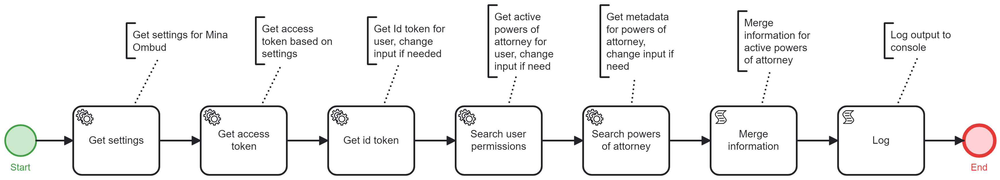

# Onify Blueprint: Get powers of attorney data from Mina Ombud (Bolagsverket)

Bolagsverket's [Mina Ombud](https://minaombud.se/) provides a digital service where you can easily make and keep track of your powers of attorney. With a digital power of attorney, you can represent companies online, based on the permissions you get. You can share and use a digital power of attorney with municipalities, authorities, and other organizations connected to Mina Ombud. If you've given a power of attorney, you can revoke it at any time, making it invalid. If you have received a power of attorney, you can return it whenever you want.

> Note: Currently, the Mina Ombud service is only available for company owners, allowing them to create digital powers of attorney. However, in the future, the service will also offer the ability to represent individuals. 

This blueprint primarily demonstrates how to retrieve a list of all historical and valid powers of attorney for an individual at a specific third party, such as a municipality.

> Note: This has only been tested against examples provided in the [mina-ombud-samples](https://github.com/bolagsverket/mina-ombud-samples) repository. This blueprint does not demonstrate the signing and verification of ID tokens (JWT), which is a requirement in the production environment. Please visit [Mina Ombud Admin](https://admin.minaombud.se/) for more detailed technical information about Mina Ombud.

## Requirements

These are the technical requirements.

* [Onify Hub](https://github.com/onify/install)
* [Onify Hub Functions](https://github.com/onify/hub-functions)
* [Camunda Modeler](https://camunda.com/download/modeler/)
* Firewall opening (external ip allowed by Bolagsverket in their firewall) 

## Setup

### Onify

Add the following settings in Onify:

|Key|Value|Type|Tag|Role|
|---|-----|----|---|----|
|bolagsverket_mina_ombud_auth_url|`https://fullmakt-test.minaombud.se/sample`|string|minaombud, bolagsverket|admin|
|bolagsverket_mina_ombud_client_id|`mina-ombud-sample` (or client id provided by Mina Ombud)|string|minaombud, bolagsverket|admin|
|bolagsverket_mina_ombud_client_secret|`************` (see mina-ombud-samples repo for client secret for mina-ombud-sample)|pssword|minaombud, bolagsverket|admin|
|bolagsverket_mina_ombud_token_url|`[mina-ombud-sample](https://auth-accept.minaombud.se/auth/realms/dfm-accept2/protocol/openid-connect/token)`|string|minaombud, bolagsverket|admin|

> Note: Create settings via admin interface and add a leading `_` in key. This is required for flow to work.

## Test

1. Open the BPMN diagram in Camunda Modeler.
2. Deploy the BPMN diagram (click `Deploy current diagram` and follow the steps).
3. Run it (click `Start current diagram`).

## Support

* Community/forum: https://support.onify.co/discuss
* Documentation: https://support.onify.co/docs
* Support and SLA: https://support.onify.co/docs/get-support

## License

This project is licensed under the MIT License - see the [LICENSE](LICENSE) file for details.
